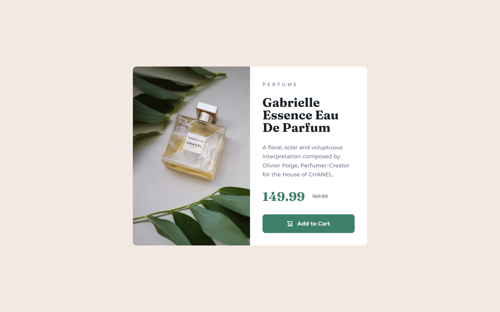

# Frontend Mentor - Product preview card component solution

This is a solution to the [Product preview card component challenge on Frontend Mentor](https://www.frontendmentor.io/challenges/product-preview-card-component-GO7UmttRfa).

## Table of contents

- [Overview](#overview)
  - [The challenge](#the-challenge)
  - [Screenshots](#screenshots)
- [Built with](#built-with)
- [Key Features](#key-features)
- [Links](#links)

## Overview

### The challenge

Users should be able to:

- ✅ View the optimal layout depending on their device's screen size
- ✅ See hover and focus states for interactive elements

### Screenshot

| Mobile Preview                | Tablet Preview                | Desktop Preview                |
| ----------------------------- | ----------------------------- | ------------------------------ |
|  |  |  |

## Built with

## Key Features

- 📱 Semantic HTML5 markup
- 🎨 Mobile-first responsive design using Tailwind CSS
- 🔍 Proper SEO setup with metadata and viewport configuration
- 🧪 Comprehensive testing with Vitest and React Testing Library

## Links

- Solution URL: [Frontend Mentor ↗](https://www.frontendmentor.io/solutions/product-preview-card-component-zZCaHSUuRU)
- Live Site URL: [Open on Vercel ↗](https://product-preview-card-component-ten-sepia.vercel.app)
